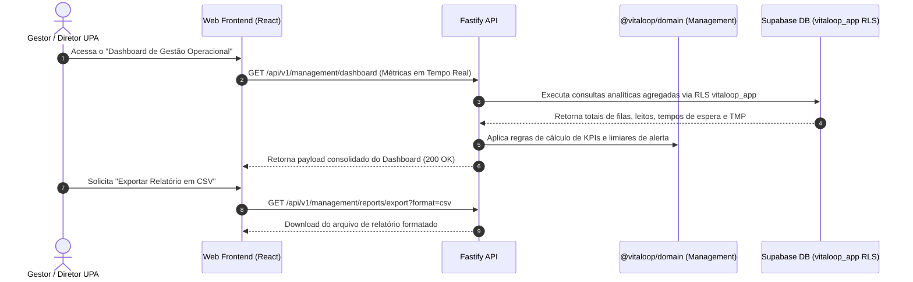

# Plano de Implementação — Fase 7 / Etapa 1 de X: Gestão Operacional, Dashboards em Tempo Real e Indicadores da UPA (`MGT-001..010`)

## 1. Identificação Oficial da Etapa
- **Fase:** FASE 7 — GESTÃO OPERACIONAL, DASHBOARDS EM TEMPO REAL E INDICADORES DA UPA
- **Etapa:** ETAPA 1 DE X DA FASE 7 — DASHBOARD OPERACIONAL, MONITORAMENTO DE TEMPO DE ESPERA, TAXA DE OCUPAÇÃO DE LEITOS E EXPORTAÇÃO GERENCIAL
- **Requisitos Cobertos:** `MGT-001`, `MGT-002`, `MGT-003`, `MGT-004`, `MGT-005`, `MGT-006`, `MGT-007`, `MGT-008`, `MGT-009`, `MGT-010`

---

## 2. Fundamentação Documental
Conforme a fundamentação dos documentos oficiais do workspace:
- **Blueprint Funcional Clínico (`Documento 1`):** §60 (Indicadores de Desempenho), §61 (Relatórios Gerenciais), §62 (Dashboards Operacionais em Tempo Real).
- **Matriz de Rastreabilidade (`Documento 3`):** Seção 21 (`MGT-001..010`).
- **`VITALOOP_1.3_STATUS.md` & `docs/PHASE_6_STEP_1_REPORT.md`:** Confirmam a homologação formal com Gate Pass das Fases 0–6 (`SAF-001..011`), deixando a Fase 7 como a próxima etapa assistencial e gerencial pendente no roadmap oficial.

---

## 3. Requisitos Abrangidos (`MGT-001..010`)

| Requisito | Nome do Requisito | Descrição Sintética |
| :--- | :--- | :--- |
| **MGT-001** | Dashboard Operacional em Tempo Real | Painel executivo consolidando status das filas, leitos, atendimentos em andamento e triagens. |
| **MGT-002** | Indicadores de Tempo de Espera (Manchester) | Comparativo de tempo-alvo do Manchester (0m a 240m) vs tempo real decorrido até a consulta médica. |
| **MGT-003** | Taxa de Ocupação e Giro de Leitos | Percentual de ocupação dos leitos de observação UPA 24h por setor assistencial. |
| **MGT-004** | Tempo Médio de Permanência (TMP < 24h) | Monitoramento de permanência do paciente na UPA e alertas para permanência superior a 24 horas. |
| **MGT-005** | Volume por Classificação de Risco | Distribuição de atendimentos por cores do Manchester (Vermelho, Laranja, Amarelo, Verde, Azul). |
| **MGT-006** | Produtividade Médica e de Enfermagem | Métricas quantitativas de consultas, triagens, prescrições e procedimentos por profissional. |
| **MGT-007** | Relatório de Desfechos Assistenciais | Consolidado estatístico de altas, transferências, internações e óbitos na UPA. |
| **MGT-008** | Exportação de Relatórios Gerenciais | Geração e download de relatórios em formato CSV / PDF com filtros por período e setor. |
| **MGT-009** | Alertas de Lotação e Sobrecarga | Notificação automática quando a fila de espera ou a ocupação de leitos ultrapassa o limite crítico. |
| **MGT-010** | Painel de Metas do Ministério da Saúde | Indicadores de desempenho alinhados às diretrizes do PNH (Política Nacional de Humanização) e MS. |

---

## 4. Objetivo Clínico e Assistencial
Fornecer visibilidade executiva e operacional em tempo real da UPA 24h para diretores, coordenadores médicos/de enfermagem e gestores da unidade. O módulo consolida métricas de tempo de espera do Protocolo de Manchester (previsto x realizado), taxa de ocupação dos leitos de observação, tempo médio de permanência (TMP com alerta de retenção > 24h), volume de atendimentos por classificação de risco, produtividade das equipes médicas e de enfermagem, relatórios analíticos exportáveis (CSV/PDF) e alertas automáticos de sobrecarga da unidade (sobrelotação de fila/leitos).

---

## 5. Fluxo Funcional Esperado


---

## 6. Regras de Negócio e Segurança
1. **Perfil de Acesso (`management.read`):** Apenas diretores, coordenadores assistenciais e perfis administrativos autorizados (`roles: ['admin', 'doctor', 'nurse']`) têm acesso aos painéis de gestão e produtividade.
2. **Tempo Médio de Permanência (TMP):** Calculado a partir da hora de abertura do atendimento (`app.encounters.created_at`) até a alta/desfecho (`app.encounter_outcomes.created_at`). Caso a permanência ultrapasse 24 horas sem desfecho, é gerado alerta de retenção gerencial.
3. **Privacidade e LGPD:** Relatórios estatísticos de produtividade e gestão não expõem dados clínicos sensíveis desnecessários de pacientes.

---

## 7. Modelo de Dados Proposto (Especificação da Migration 0037)
A ser criada no momento da execução como `db/migrations/0037_operational_management_dashboards.sql` (estritamente aditiva, sem alterar 0001 a 0036):

```sql
-- Migration 0037: Gestão Operacional, Dashboards e Alertas de Lotação (MGT-001..010)

-- 1. Tabela de Alertas Gerenciais de Sobrecarga (MGT-009)
create table if not exists app.management_alerts (
  id uuid primary key default gen_random_uuid(),
  alert_type text not null, -- queue_overcrowded, beds_full, wait_time_exceeded, tmp_exceeded
  severity text not null default 'warning', -- warning, critical
  message text not null,
  metric_value numeric,
  threshold_value numeric,
  is_acknowledged boolean not null default false,
  acknowledged_by uuid references app.users(id) on delete set null,
  created_at timestamptz not null default now()
);

-- 2. View Analítica de Resumo Operacional em Tempo Real (MGT-001..005)
create or replace view app.v_operational_summary as
select
  (select count(*)::int from app.encounters where status not in ('completed', 'canceled')) as active_encounters_count,
  (select count(*)::int from app.encounters where status = 'triage_pending') as triage_pending_count,
  (select count(*)::int from app.encounters where status = 'consultation_pending') as consultation_pending_count,
  (select count(*)::int from app.beds where status = 'occupied') as occupied_beds_count,
  (select count(*)::int from app.beds) as total_beds_count,
  case 
    when (select count(*) from app.beds) > 0 
    then round(((select count(*)::numeric from app.beds where status = 'occupied') / (select count(*)::numeric from app.beds)) * 100, 2)
    else 0 
  end as bed_occupancy_rate;

-- Habilitar RLS
alter table app.management_alerts enable row level security;
alter view app.v_operational_summary set (security_invoker = true);

-- Políticas RLS
drop policy if exists management_alerts_select on app.management_alerts;
drop policy if exists management_alerts_update on app.management_alerts;
create policy management_alerts_select on app.management_alerts for select to vitaloop_app using (app.has_permission('management.read'));
create policy management_alerts_update on app.management_alerts for update to vitaloop_app using (app.has_permission('management.alerts'));

-- Concessões à role vitaloop_app
grant select, insert, update, delete on app.management_alerts to vitaloop_app;
grant select on app.v_operational_summary to vitaloop_app;

-- Permissões RBAC
insert into app.permissions (code, name, resource, action) values
  ('management.read',   'Consultar dashboard gerencial e indicadores operacionais', 'management', 'read'),
  ('management.export', 'Exportar relatórios gerenciais e estatísticos', 'management', 'export'),
  ('management.alerts', 'Gerenciar e reconhecer alertas de sobrecarga', 'management', 'alerts')
on conflict (code) do nothing;

insert into app.role_permissions (role_id, permission_id)
select r.id, p.id from app.roles r, app.permissions p
where r.code in ('admin', 'doctor', 'nurse', 'test_patient_full')
  and p.code in ('management.read', 'management.export', 'management.alerts')
on conflict do nothing;
```

---

## 8. Migration Proposta
- `0037_operational_management_dashboards.sql` (Somente especificada neste planejamento; NÃO criada nem aplicada nesta rodada).

---

## 9. RLS / RBAC
- Políticas de RLS aplicadas em `app.management_alerts` e `app.v_operational_summary` com `security_invoker = true`.
- Permissões RBAC: `management.read`, `management.export`, `management.alerts`.

---

## 10. Domínio e Eventos
- Módulo `packages/domain/src/management/`:
  - `calculateKpiMetrics(...)`: Calculadora pura de taxa de ocupação, tempo médio de espera e TMP.
  - `evaluateOvercrowdingAlerts(...)`: Avaliação de limiares de sobrecarga.

---

## 11. API REST (Fastify)
- `GET /api/v1/management/dashboard` (Painel em tempo real)
- `GET /api/v1/management/alerts` (Lista de alertas de sobrecarga)
- `POST /api/v1/management/alerts/:id/acknowledge` (Reconhecimento de alerta)
- `GET /api/v1/management/reports/export` (Exportação CSV de atendimentos)

---

## 12. Frontend (React)
- Componente `ManagementDashboardPage.tsx`: Dashboard gerencial com cards de KPIs, gráficos de fila/leitos e exportação.

---

## 13. Auditoria e Patient Timeline
- Operações de exportação de relatórios gravadas em `app.audit_events`.

---

## 14. Estratégia de Testes
- Testes unitários do domínio.
- Testes de UI React.
- Testes de integração Fastify `.inject()` contra o Supabase remoto com `vitaloop_app` sob RLS.

---

## 15. Regressão Obrigatória
- Execução da suíte de regressão integral das Fases 0–6.

---

## 16. Critérios de GATE PASS
- 100% de aprovação nos testes remotos contra Supabase (`vitaloop_app`).
- ESLint 0 erros/avisos, Typecheck 0 erros, Build 0 erros.
- Zero resíduos de dados de teste no Supabase DB (`TEST DATA RESIDUAL: 0`).

---

## 17. Limpeza de Dados de Teste
- Script de teardown purga todos os dados gerados durante a suíte de testes.

---

## 18. Lacunas / "NÃO DEFINIDO NO BLUEPRINT"
- Modelos preditivos neurais de inteligência artificial para previsão de afluência de pacientes.
- Transmissão de vídeo ao vivo do tráfego urbano de ambulâncias.

---

## 19. Fora do Escopo
- Faturamento SUS / AIH (`SUS-001..010` — reservados para a Fase 8).
- Barramento FHIR/HL7 (`INT-001..010` — reservados para a Fase 9).

---

## 20. Estado Final do Planejamento
STATUS: PLANEJAMENTO CONCLUÍDO
ETAPA ATUAL: FASE 6 / ETAPA 1/X — GATE PASS
PRÓXIMA ETAPA: FASE 7 / ETAPA 1 DE X — GESTÃO OPERACIONAL, DASHBOARDS EM TEMPO REAL E INDICADORES DA UPA
REQUISITOS: MGT-001..010
EXECUÇÃO: NÃO INICIADA
ALTERAÇÕES NO CÓDIGO: NENHUMA
ALTERAÇÕES NO BANCO: NENHUMA
MIGRATION: NÃO CRIADA/APLICADA
SUPABASE: NÃO ALTERADO
COMMIT/PUSH: NÃO REALIZADO
DOCUMENTO: implementation_plan_phase_7_step_1.md
