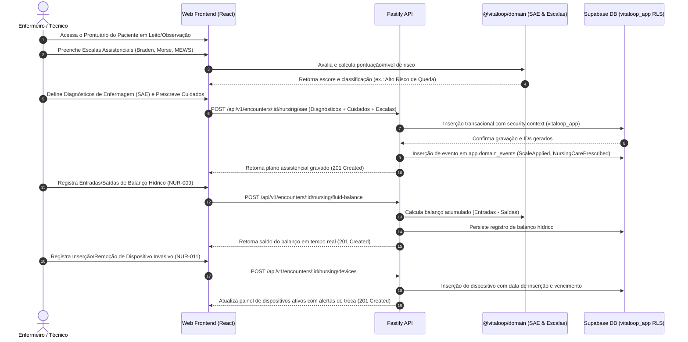

# Plano de Implementação — Fase 4 / Etapa 3 de X: SAE, Escalas Assistenciais, Balanço Hídrico, Dispositivos Invasivos e Cuidados (`NUR-004..012`)

## 1. Confirmação do Estado de Homologação Anterior

- **Fase 4 / Etapa 1 (`NUR-001..003`, `MEDC-009..011`):** **CONCLUÍDA E HOMOLOGADA COM GATE PASS CONFIRMADO** (`docs/PHASE_4_STEP_1_REPORT.md`).
- **Fase 4 / Etapa 2 (`BED-001..013`):** **CONCLUÍDA E HOMOLOGADA COM GATE PASS CONFIRMADO** (`docs/PHASE_4_STEP_2_REPORT.md`).

---

## 2. Identificação Oficial da Próxima Etapa

- **Fase:** FASE 4 — CUIDADOS DE ENFERMAGEM, APRAZAMENTO/ADMINISTRAÇÃO DE MEDICAMENTOS E GESTÃO DE LEITOS DA UPA
- **Etapa Oficial:** ETAPA 3 DE X — SISTEMATIZAÇÃO DA ASSISTÊNCIA DE ENFERMAGEM (SAE), ESCALAS ASSISTENCIAIS, BALANÇO HÍDRICO, CONTROLE DE DISPOSITIVOS INVASIVOS E CUIDADOS DE ENFERMAGEM
- **Requisitos Cobertos:** `NUR-004`, `NUR-005`, `NUR-006`, `NUR-007`, `NUR-008`, `NUR-009`, `NUR-010`, `NUR-011`, `NUR-012`
- **Sustentação Documental:** Blueprint Funcional Clínico (`Documento 1` §4/§10), Matriz de Rastreabilidade (`Documento 3` Seções 14, 15, 17) e Roadmap Oficial Pós-Fase 3 (`VITALOOP_1.3_ROADMAP_POS_FASE_3.md`).

---

## 3. Objetivo Clínico e Operacional

Estruturar a assistência continuada e avançada de enfermagem no ambiente da UPA 24h, garantindo a execução do Processo de Enfermagem (SAE), a padronização dos Diagnósticos e Intervenções de Enfermagem (NANDA/CIPA), a aplicação automatizada de Escalas Assistenciais de Risco e Gravidade (Braden, Morse, Glasgow, Ramsay, MEWS/NEWS), o monitoramento seriado do Balanço Hídrico (entradas e saídas de líquidos em $mL$), a gestão rastreável de Dispositivos Invasivos (acessos vasculares, sondas, drenos) e a identificação/notificação contínua dos Riscos Assistenciais do paciente sob observação ou acomodado em leito.

---

## 4. Dependências com Módulos Já Homologados

1. **Fase 1 (Homologada):** Autenticação Supabase, RBAC, auditoria hashing de IP e RLS efetiva com a role `vitaloop_app`.
2. **Fase 2 (Homologada):** Cadastro de Pacientes (`PAT`), Atendimento UPA 24h (`ENC`), Triagem e Classificação de Risco Manchester (`TRG`).
3. **Fase 3 (Homologada):** Prescrição Médica (`MEDC`), Exames/Procedimentos (`EXM`) e Desfecho/Internação/Observação (`OUT`).
4. **Fase 4 / Etapa 1 (Homologada):** Admissão, Evolução e Anotações de Enfermagem (`NUR-001..003`), Aprazamento e Checagem Beira-Leito 5 Certos (`MEDC-009..011`).
5. **Fase 4 / Etapa 2 (Homologada):** Gestão de Leitos, Mapa de Ocupação e Acomodação de Observação/Sala Vermelha (`BED-001..013`).

---

## 5. Requisitos Abrangidos nesta Etapa (`NUR-004..012`)

| Requisito | Nome do Requisito | Descrição Sintética |
| :--- | :--- | :--- |
| **NUR-004** | Processo de Enfermagem (SAE) | Estruturação das 5 etapas da SAE (Investigação, Diagnóstico, Planejamento, Implementação e Avaliação). |
| **NUR-005** | Diagnósticos de Enfermagem | Seleção e vínculo de diagnósticos padronizados de enfermagem (NANDA/CIPA) com título, fatores relacionados e características definidoras. |
| **NUR-006** | Prescrição de Enfermagem | Elaboração e aprazamento de prescrições de cuidados de enfermagem (mudança de decúbito, aspiração, curativo). |
| **NUR-007** | Procedimentos de Enfermagem | Registro de execução de procedimentos técnicos (sondagens, punções venosas, nebulização, curativos). |
| **NUR-008** | Sinais Vitais de Reavaliação | Registro seriado de sinais vitais durante a permanência no leito com alertas automáticos de alteração. |
| **NUR-009** | Balanço Hídrico | Registro contínuo de entradas (VO, EV, dietas) e saídas (diurese, drenagem, emese) com cálculo parcial e fechamento em 24h. |
| **NUR-010** | Escalas Assistenciais | Avaliação automatizada de risco e gravidade pelas escalas Braden (lesão por pressão), Morse (quedas), Glasgow (neurológico) e MEWS/NEWS (deterioração clínica). |
| **NUR-011** | Controle de Dispositivos Invasivos | Cadastro e rastreamento de acessos venosos, sondas (SNG/SNE/SVD), drenos e tubos com alertas de tempo de permanência e vencimento da troca. |
| **NUR-012** | Riscos Assistenciais | Registro de riscos identificados no paciente (risco de queda, risco de broncoaspiração, risco de LPP, alergia a látex). |

---

## 6. Fluxo Funcional Esperado



---

## 7. Regras de Negócio e Segurança Clínica

1. **SAE e Diagnósticos de Enfermagem (`NUR-004/005/006`):**
   - Apenas enfermeiros habilitados (`roles: ['nurse', 'admin']`) podem prescrever cuidados de enfermagem e cadastrar diagnósticos SAE.
   - Técnicos de enfermagem (`roles: ['nursing_technician']`) realizam checagem de execução e registro de procedimentos (`NUR-007`).
2. **Escalas Assistenciais (`NUR-010`):**
   - Braden ≤ 12 -> Alerta de Alto Risco de Lesão por Pressão (LPP).
   - Morse ≥ 45 -> Alerta de Alto Risco de Quedas.
   - Glasgow ≤ 8 -> Alerta de Rebaixamento Neurológico Severo.
   - MEWS ≥ 5 -> Alerta de Risco de Deterioração Clínica Iminente (avaliação médica obrigatória).
3. **Balanço Hídrico (`NUR-009`):**
   - Gravação contínua em $mL$ com saldo parcial acumulado ($B_{\text{acumulado}} = \sum \text{Entradas} - \sum \text{Saídas}$).
   - Fechamento em 24h com geração de evento de domínio `FluidBalanceClosed`.
4. **Controle de Dispositivos (`NUR-011`):**
   - Monitoramento do tempo de permanência de acessos vasculares, drenos e sondas com alertas visuais de vencimento da troca.

---

## 8. Modelo de Dados Proposto (Especificação da Migration 0034)

A ser criada no momento da execução como `db/migrations/0034_nursing_process_scales_devices.sql` (estritamente aditiva, sem alterar 0001 a 0033):

```sql
-- Migration 0034: SAE, Escalas Assistenciais, Balanço Hídrico e Dispositivos (NUR-004..012)

do $$ begin
  create type app.invasive_device_type as enum (
    'peripheral_venous_access', 'central_venous_access', 'urinary_catheter', 
    'nasogastric_tube', 'nasoenteric_tube', 'chest_drain', 'endotracheal_tube', 'tracheostomy'
  );
exception when duplicate_object then null; end $$;

do $$ begin
  create type app.device_status as enum ('active', 'removed', 'replaced', 'accidental_withdrawal');
exception when duplicate_object then null; end $$;

do $$ begin
  create type app.fluid_type as enum ('oral', 'intravenous', 'enteral', 'blood_products', 'urine', 'emesis', 'drainage', 'feces');
exception when duplicate_object then null; end $$;

do $$ begin
  create type app.fluid_direction as enum ('intake', 'output');
exception when duplicate_object then null; end $$;

-- 1. Diagnósticos de Enfermagem (NANDA/CIPA - NUR-005)
create table if not exists app.nursing_diagnoses (
  id uuid primary key default gen_random_uuid(),
  encounter_id uuid not null references app.encounters(id) on delete cascade,
  patient_id uuid not null references app.patients(id) on delete cascade,
  nurse_id uuid not null references app.users(id) on delete restrict,
  code text not null,
  title text not null,
  domain_name text,
  related_factors text,
  defining_characteristics text,
  status text not null default 'active',
  created_at timestamptz not null default now(),
  updated_at timestamptz not null default now()
);

-- 2. Prescrição e Intervenções de Enfermagem (NUR-006)
create table if not exists app.nursing_prescriptions (
  id uuid primary key default gen_random_uuid(),
  encounter_id uuid not null references app.encounters(id) on delete cascade,
  patient_id uuid not null references app.patients(id) on delete cascade,
  nurse_id uuid not null references app.users(id) on delete restrict,
  care_description text not null,
  frequency_hours integer,
  status text not null default 'active',
  created_at timestamptz not null default now()
);

-- 3. Registro de Procedimentos e Intervenções de Enfermagem (NUR-007)
create table if not exists app.nursing_procedures (
  id uuid primary key default gen_random_uuid(),
  encounter_id uuid not null references app.encounters(id) on delete cascade,
  patient_id uuid not null references app.patients(id) on delete cascade,
  professional_id uuid not null references app.users(id) on delete restrict,
  procedure_name text not null,
  category text not null,
  notes text,
  performed_at timestamptz not null default now(),
  created_at timestamptz not null default now()
);

-- 4. Escalas Assistenciais (Braden, Morse, Glasgow, MEWS - NUR-010)
create table if not exists app.nursing_scale_evaluations (
  id uuid primary key default gen_random_uuid(),
  encounter_id uuid not null references app.encounters(id) on delete cascade,
  patient_id uuid not null references app.patients(id) on delete cascade,
  evaluator_id uuid not null references app.users(id) on delete restrict,
  scale_type text not null,
  total_score integer not null,
  risk_level text not null,
  score_details jsonb not null,
  evaluated_at timestamptz not null default now(),
  created_at timestamptz not null default now()
);

-- 5. Balanço Hídrico (NUR-009)
create table if not exists app.fluid_balance_records (
  id uuid primary key default gen_random_uuid(),
  encounter_id uuid not null references app.encounters(id) on delete cascade,
  patient_id uuid not null references app.patients(id) on delete cascade,
  recorder_id uuid not null references app.users(id) on delete restrict,
  direction app.fluid_direction not null,
  fluid_type app.fluid_type not null,
  volume_ml integer not null check (volume_ml > 0),
  description text,
  recorded_at timestamptz not null default now(),
  created_at timestamptz not null default now()
);

-- 6. Controle de Dispositivos Invasivos (NUR-011)
create table if not exists app.invasive_devices (
  id uuid primary key default gen_random_uuid(),
  encounter_id uuid not null references app.encounters(id) on delete cascade,
  patient_id uuid not null references app.patients(id) on delete cascade,
  inserter_id uuid not null references app.users(id) on delete restrict,
  device_type app.invasive_device_type not null,
  anatomical_site text not null,
  status app.device_status not null default 'active',
  inserted_at timestamptz not null default now(),
  expected_replacement_at timestamptz,
  removed_at timestamptz,
  remover_id uuid references app.users(id) on delete restrict,
  removal_reason text,
  notes text,
  created_at timestamptz not null default now(),
  updated_at timestamptz not null default now()
);

-- 7. Riscos Assistenciais do Paciente (NUR-012)
create table if not exists app.patient_risk_assessments (
  id uuid primary key default gen_random_uuid(),
  encounter_id uuid not null references app.encounters(id) on delete cascade,
  patient_id uuid not null references app.patients(id) on delete cascade,
  evaluator_id uuid not null references app.users(id) on delete restrict,
  risk_type text not null,
  is_active boolean not null default true,
  risk_level text not null,
  identified_at timestamptz not null default now(),
  resolved_at timestamptz,
  created_at timestamptz not null default now()
);

-- 8. Habilitar RLS
alter table app.nursing_diagnoses enable row level security;
alter table app.nursing_prescriptions enable row level security;
alter table app.nursing_procedures enable row level security;
alter table app.nursing_scale_evaluations enable row level security;
alter table app.fluid_balance_records enable row level security;
alter table app.invasive_devices enable row level security;
alter table app.patient_risk_assessments enable row level security;

-- 9. Políticas RLS
drop policy if exists nursing_diagnoses_select on app.nursing_diagnoses;
drop policy if exists nursing_diagnoses_insert on app.nursing_diagnoses;
create policy nursing_diagnoses_select on app.nursing_diagnoses for select to vitaloop_app using (app.has_permission('nursing.read'));
create policy nursing_diagnoses_insert on app.nursing_diagnoses for insert to vitaloop_app with check (app.has_permission('nursing.sae'));

drop policy if exists nursing_prescriptions_select on app.nursing_prescriptions;
drop policy if exists nursing_prescriptions_insert on app.nursing_prescriptions;
create policy nursing_prescriptions_select on app.nursing_prescriptions for select to vitaloop_app using (app.has_permission('nursing.read'));
create policy nursing_prescriptions_insert on app.nursing_prescriptions for insert to vitaloop_app with check (app.has_permission('nursing.sae'));

drop policy if exists nursing_procedures_select on app.nursing_procedures;
drop policy if exists nursing_procedures_insert on app.nursing_procedures;
create policy nursing_procedures_select on app.nursing_procedures for select to vitaloop_app using (app.has_permission('nursing.read'));
create policy nursing_procedures_insert on app.nursing_procedures for insert to vitaloop_app with check (app.has_permission('nursing.procedure'));

drop policy if exists nursing_scale_evaluations_select on app.nursing_scale_evaluations;
drop policy if exists nursing_scale_evaluations_insert on app.nursing_scale_evaluations;
create policy nursing_scale_evaluations_select on app.nursing_scale_evaluations for select to vitaloop_app using (app.has_permission('nursing.read'));
create policy nursing_scale_evaluations_insert on app.nursing_scale_evaluations for insert to vitaloop_app with check (app.has_permission('nursing.scales'));

drop policy if exists fluid_balance_records_select on app.fluid_balance_records;
drop policy if exists fluid_balance_records_insert on app.fluid_balance_records;
create policy fluid_balance_records_select on app.fluid_balance_records for select to vitaloop_app using (app.has_permission('nursing.read'));
create policy fluid_balance_records_insert on app.fluid_balance_records for insert to vitaloop_app with check (app.has_permission('nursing.balance'));

drop policy if exists invasive_devices_select on app.invasive_devices;
drop policy if exists invasive_devices_insert on app.invasive_devices;
drop policy if exists invasive_devices_update on app.invasive_devices;
create policy invasive_devices_select on app.invasive_devices for select to vitaloop_app using (app.has_permission('nursing.read'));
create policy invasive_devices_insert on app.invasive_devices for insert to vitaloop_app with check (app.has_permission('nursing.device'));
create policy invasive_devices_update on app.invasive_devices for update to vitaloop_app using (app.has_permission('nursing.device'));

drop policy if exists patient_risk_assessments_select on app.patient_risk_assessments;
drop policy if exists patient_risk_assessments_insert on app.patient_risk_assessments;
create policy patient_risk_assessments_select on app.patient_risk_assessments for select to vitaloop_app using (app.has_permission('nursing.read'));
create policy patient_risk_assessments_insert on app.patient_risk_assessments for insert to vitaloop_app with check (app.has_permission('nursing.sae') or app.has_permission('nursing.scales'));

-- 10. Concessão de Permissões à role vitaloop_app
grant select, insert, update, delete on app.nursing_diagnoses to vitaloop_app;
grant select, insert, update, delete on app.nursing_prescriptions to vitaloop_app;
grant select, insert, update, delete on app.nursing_procedures to vitaloop_app;
grant select, insert, update, delete on app.nursing_scale_evaluations to vitaloop_app;
grant select, insert, update, delete on app.fluid_balance_records to vitaloop_app;
grant select, insert, update, delete on app.invasive_devices to vitaloop_app;
grant select, insert, update, delete on app.patient_risk_assessments to vitaloop_app;

-- 11. Permissões RBAC
insert into app.permissions (code, name, resource, action) values
  ('nursing.sae',       'Elaborar SAE e prescrever cuidados de enfermagem', 'nursing', 'sae'),
  ('nursing.procedure', 'Registrar procedimentos e intervenções técnicas', 'nursing', 'procedure'),
  ('nursing.scales',    'Aplicar escalas assistenciais (Braden, Morse, etc)', 'nursing', 'scales'),
  ('nursing.balance',   'Registrar balanço hídrico',                        'nursing', 'balance'),
  ('nursing.device',    'Inserir, monitorar e remover dispositivos invasivos', 'nursing', 'device')
on conflict (code) do nothing;

insert into app.role_permissions (role_id, permission_id)
select r.id, p.id from app.roles r, app.permissions p
where r.code in ('nurse', 'nursing_technician', 'doctor', 'admin', 'test_patient_full')
  and p.code in ('nursing.sae', 'nursing.procedure', 'nursing.scales', 'nursing.balance', 'nursing.device')
on conflict do nothing;
```

---

## 9. RLS e RBAC
- Role: `vitaloop_app`.
- Permissões RBAC inseridas: `nursing.sae`, `nursing.procedure`, `nursing.scales`, `nursing.balance`, `nursing.device`.

---

## 10. Camada de Domínio (`@vitaloop/domain`)
- Módulo `packages/domain/src/nursing-sae/`:
  - Calculadoras de Escalas Assistenciais (`calculateBradenScore`, `calculateMorseScore`, `calculateGlasgowScore`, `calculateMewsScore`).
  - Calculadora de Balanço Hídrico (`calculateFluidBalanceTotal`).
  - Eventos de Domínio (`ScaleApplied`, `NursingSaeRecorded`, `FluidBalanceRecorded`, `InvasiveDeviceInserted`, `InvasiveDeviceRemoved`).

---

## 11. Especificação de APIs REST (Fastify)
- `POST /api/v1/encounters/:id/nursing/sae`
- `POST /api/v1/encounters/:id/nursing/scales`
- `POST /api/v1/encounters/:id/nursing/fluid-balance`
- `GET /api/v1/encounters/:id/nursing/fluid-balance/summary`
- `POST /api/v1/encounters/:id/nursing/devices`
- `PATCH /api/v1/nursing/devices/:deviceId/remove`

---

## 12. Componentes Frontend React (`apps/web`)
- `NursingSaeTab.tsx` (SAE e Prescrição de Cuidados)
- `NursingScalesModal.tsx` (Calculadora interativa de escalas)
- `FluidBalanceGrid.tsx` (Grade visual de Entradas/Saídas de líquidos)
- `DeviceControlPanel.tsx` (Painel de Dispositivos Invasivos com alertas)

---

## 13. Eventos de Domínio, Auditoria e Timeline
- Eventos gravados em `app.domain_events` e expostos na view `app.patient_timeline`.
- Auditoria com hashing de IP registrada em `app.audit_events`.

---

## 14. Estratégia de Testes
- Testes unitários do domínio.
- Testes de UI dos componentes React.
- Testes de integração Fastify `.inject()` contra o Supabase remoto utilizando a role `vitaloop_app`.
- Validação de RLS sem sessão.
- Bateria de regressão completa das etapas anteriores (`beds.api.test.ts`, `nursing.api.test.ts`).

---

## 15. Critérios para GATE PASS
- 100% PASS na suíte de testes de integração real.
- ESLint 0 erros/avisos.
- Typecheck 0 erros.
- Build 0 erros.
- Zero resíduos de dados de testes na base Supabase.

---

## 16. Classificação "NÃO DEFINIDO NO BLUEPRINT"
- Importação automática de sinais vitais via webservices HL7/IEEE 11073 de monitores multiparâmetros.
- Leitor de código de barras físico para leitura automática de identificadores de cateteres.

---

## 17. Fora do Escopo
- Emissão de documentos e atestados médicos (`DOC-001..010` — reservados para a Fase 5).
- Notificação de incidentes externos (`SAF-001..012` — reservados para a Fase 6).
- Faturamento SUS / AIH (`SUS-001..010` — reservados para a Fase 8).
