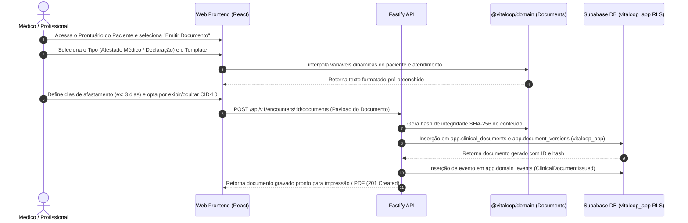

# Plano de Implementação — Fase 5 / Etapa 1 de X (Fase 4 Concluída): Documentos Clínicos Complementares (`DOC-001..010`)

## 1. Confirmação do Encerramento Integral da Fase 4

Todas as 3 Etapas da **FASE 4 — CUIDADOS DE ENFERMAGEM, APRAZAMENTO/ADMINISTRAÇÃO DE MEDICAMENTOS E GESTÃO DE LEITOS DA UPA** foram concluídas e homologadas com Gate Pass confirmado:

1. **Fase 4 / Etapa 1 (`NUR-001..003`, `MEDC-009..011`):** Admissão, Evolução, Anotação de Enfermagem, Aprazamento e Checagem Beira-Leito 5 Certos — **HOMOLOGADA COM GATE PASS** (`docs/PHASE_4_STEP_1_REPORT.md`).
2. **Fase 4 / Etapa 2 (`BED-001..013`):** Gestão de Leitos UPA 24h, Setores, Mapa de Ocupação, Leito Extra, Transferências e Limite de 24h — **HOMOLOGADA COM GATE PASS** (`docs/PHASE_4_STEP_2_REPORT.md`).
3. **Fase 4 / Etapa 3 (`NUR-004..012`):** SAE, Diagnósticos NANDA/CIPA, Prescrição de Cuidados, Escalas Braden/Morse/Glasgow/MEWS, Balanço Hídrico e Dispositivos Invasivos — **HOMOLOGADA COM GATE PASS** (`docs/PHASE_4_STEP_3_REPORT.md`).

---

## 2. Identificação Oficial da Próxima Etapa

Conforme o Roadmap Oficial Pós-Fase 3 (`VITALOOP_1.3_ROADMAP_POS_FASE_3.md` §2), o Blueprint Funcional Clínico (`Documento 1` §12) e a Matriz de Rastreabilidade (`Documento 3` Seção 19), a Fase 4 está 100% encerrada. A próxima fase assistencial oficial do projeto é:

- **Macro-Fase:** FASE 5 — DOCUMENTOS CLÍNICOS COMPLEMENTARES, ATESTADOS E DECLARAÇÕES MÉDICAS ESTRUTURADAS
- **Etapa Oficial:** ETAPA 1 DE X DA FASE 5 — EMISSÃO DE ATESTADOS MÉDICOS, DECLARAÇÕES DE COMPARECIMENTO, TEMPLATES E RELATÓRIOS CLÍNICOS ESTRUTURADOS
- **Requisitos Cobertos:** `DOC-001`, `DOC-002`, `DOC-003`, `DOC-004`, `DOC-005`, `DOC-006`, `DOC-007`, `DOC-008`, `DOC-009`, `DOC-010`
- **Sustentação Documental:** Blueprint Funcional Clínico (`Documento 1` §12), Matriz de Rastreabilidade (`Documento 3` Seção 19: `DOC-001..010`) e Roadmap Oficial Pós-Fase 3 (`VITALOOP_1.3_ROADMAP_POS_FASE_3.md` Seção 2/3).

---

## 3. Objetivo Clínico e Operacional

Prover a infraestrutura de geração, gerenciamento e validação de documentos clínicos oficiais emitidos pela equipe médica e assistencial da UPA 24h, garantindo a emissão padronizada de Atestados Médicos (com indicação por extenso de dias de afastamento e opção LGPD de ocultação/exibição de CID-10), Declarações de Comparecimento para paciente e acompanhante, Relatórios Médicos Estruturados para transferência/perícia, Laudos de Solicitação de Procedimentos, Gerenciador de Templates com variáveis dinâmicas, Assinatura Eletrônica com Hash SHA-256 de integridade e auditoria de cancelamento/retificação com preservação do histórico de versões.

---

## 4. Requisitos Abrangidos nesta Etapa (`DOC-001..010`)

| Requisito | Nome do Requisito | Descrição Sintética |
| :--- | :--- | :--- |
| **DOC-001** | Atestado Médico de Urgência | Emissão de atestado médico informando o período de reposo/afastamento em dias por extenso, consentimento de inclusão de CID-10 e identificação do médico. |
| **DOC-002** | Declaração de Comparecimento | Declaração oficial confirmando a presença do paciente na UPA com registro de horário de entrada e saída. |
| **DOC-003** | Atestado de Acompanhante | Declaração de necessidade de acompanhamento de paciente vulnerável (menor, idoso, PCD) com dados do acompanhante. |
| **DOC-004** | Relatório / Parecer Médico | Relatório assistencial detalhado consolidando anamnese, exames, procedimentos e conduta para transferência ou perícia. |
| **DOC-005** | Gerenciador de Templates | Cadastro e customização de modelos de texto institucionais com interpolação de variáveis dinâmicas (`{{paciente_nome}}`, `{{cpf}}`, etc). |
| **DOC-006** | Laudo de Solicitação Assistencial | Formuário padronizado de solicitação de procedimento de alta complexidade. |
| **DOC-007** | Assinatura Eletrônica e Hash SHA-256 | Geração de hash criptográfico SHA-256 garantindo a imutabilidade e autenticidade do documento emitido. |
| **DOC-008** | Retificação e Cancelamento | Cancelamento ou substituição de documento emitido com justificativa técnica obrigatória e rastro de auditoria. |
| **DOC-009** | Exportação PDF / Impressão | Formatação gráfica padronizada para impressão física ou geração de arquivo PDF com cabeçalho institucional. |
| **DOC-010** | Histórico e Patient Timeline | Exibição de todos os documentos gerados no atendimento na `app.patient_timeline` e no prontuário do paciente. |

---

## 5. Fluxo Funcional Esperado



---

## 6. Regras de Negócio e Segurança Clínica

1. **Atestados Médicos (`DOC-001`):**
   - Apenas profissionais médicos (`roles: ['doctor', 'admin']`) podem emitir Atestados Médicos e Relatórios Periciais.
   - O número de dias de afastamento deve ser gravado em numeral e gerado por extenso automaticamente.
   - A inclusão do código CID-10 exige confirmação explícita de consentimento do paciente (em conformidade com a Resolução CFM nº 1.658/2002 e LGPD).
2. **Declaração de Comparecimento (`DOC-002/003`):**
   - Recepcionistas, enfermeiros e médicos podem emitir declarações de comparecimento informando o período de permanência na UPA.
3. **Imutabilidade e Assinatura Criptográfica (`DOC-007/008`):**
   - Documentos emitidos são imutáveis. Qualquer retificação gera uma nova versão em `app.document_versions` vinculada ao documento pai.
   - O cancelamento exige justificativa textual (mínimo 10 caracteres) e altera o status para `revoked`, mantendo o documento original no histórico de auditoria.

---

## 7. Modelo de Dados Proposto (Especificação da Migration 0035)

A ser criada no momento da execução como `db/migrations/0035_clinical_documents.sql` (estritamente aditiva, sem alterar 0001 a 0034):

```sql
-- Migration 0035: Documentos Clínicos Complementares e Atestados (DOC-001..010)

do $$ begin
  create type app.clinical_document_type as enum (
    'medical_certificate', 'attendance_declaration', 'companion_certificate', 
    'medical_report', 'procedure_request'
  );
exception when duplicate_object then null; end $$;

do $$ begin
  create type app.clinical_document_status as enum ('issued', 'revoked', 'rectified');
exception when duplicate_object then null; end $$;

-- 1. Gerenciador de Templates (DOC-005)
create table if not exists app.document_templates (
  id uuid primary key default gen_random_uuid(),
  document_type app.clinical_document_type not null,
  title text not null,
  body_template text not null,
  is_active boolean not null default true,
  created_at timestamptz not null default now(),
  updated_at timestamptz not null default now()
);

-- 2. Documentos Clínicos Emitidos (DOC-001..004, DOC-006)
create table if not exists app.clinical_documents (
  id uuid primary key default gen_random_uuid(),
  encounter_id uuid not null references app.encounters(id) on delete cascade,
  patient_id uuid not null references app.patients(id) on delete cascade,
  issuer_id uuid not null references app.users(id) on delete restrict,
  document_type app.clinical_document_type not null,
  status app.clinical_document_status not null default 'issued',
  title text not null,
  content text not null,
  days_off integer, -- para atestados médicos
  days_off_text text, -- dias por extenso
  include_cid boolean not null default false,
  cid_code text,
  companion_name text, -- para atestado de acompanhante
  integrity_hash text not null, -- SHA-256 do conteúdo
  revocation_reason text,
  revoked_at timestamptz,
  revoked_by uuid references app.users(id) on delete restrict,
  created_at timestamptz not null default now(),
  updated_at timestamptz not null default now()
);

-- 3. Histórico de Versões e Retificações (DOC-008)
create table if not exists app.document_versions (
  id uuid primary key default gen_random_uuid(),
  document_id uuid not null references app.clinical_documents(id) on delete cascade,
  version_number integer not null,
  content text not null,
  integrity_hash text not null,
  modified_by uuid not null references app.users(id) on delete restrict,
  change_reason text not null,
  created_at timestamptz not null default now()
);

-- Habilitar RLS
alter table app.document_templates enable row level security;
alter table app.clinical_documents enable row level security;
alter table app.document_versions enable row level security;

-- Políticas RLS
drop policy if exists document_templates_select on app.document_templates;
create policy document_templates_select on app.document_templates for select to vitaloop_app using (app.has_permission('document.read'));

drop policy if exists clinical_documents_select on app.clinical_documents;
drop policy if exists clinical_documents_insert on app.clinical_documents;
drop policy if exists clinical_documents_update on app.clinical_documents;
create policy clinical_documents_select on app.clinical_documents for select to vitaloop_app using (app.has_permission('document.read'));
create policy clinical_documents_insert on app.clinical_documents for insert to vitaloop_app with check (app.has_permission('document.issue'));
create policy clinical_documents_update on app.clinical_documents for update to vitaloop_app using (app.has_permission('document.revoke'));

drop policy if exists document_versions_select on app.document_versions;
create policy document_versions_select on app.document_versions for select to vitaloop_app using (app.has_permission('document.read'));

-- Concessão para vitaloop_app
grant select, insert, update, delete on app.document_templates to vitaloop_app;
grant select, insert, update, delete on app.clinical_documents to vitaloop_app;
grant select, insert, update, delete on app.document_versions to vitaloop_app;

-- Permissões RBAC
insert into app.permissions (code, name, resource, action) values
  ('document.read',     'Consultar documentos clínicos emitidos', 'document', 'read'),
  ('document.issue',    'Emitir atestados, declarações e relatórios clínicos', 'document', 'issue'),
  ('document.revoke',   'Retificar ou cancelar documentos clínicos', 'document', 'revoke')
on conflict (code) do nothing;

insert into app.role_permissions (role_id, permission_id)
select r.id, p.id from app.roles r, app.permissions p
where r.code in ('doctor', 'nurse', 'receptionist', 'admin', 'test_patient_full')
  and p.code in ('document.read', 'document.issue', 'document.revoke')
on conflict do nothing;
```

---

## 8. Camada de Domínio (`@vitaloop/domain`)
- Módulo `packages/domain/src/document/`:
  - `numberToWords(num)`: Utilitário para conversão de dias por extenso.
  - `generateDocumentHash(content)`: Gerador de hash SHA-256 de integridade.
  - `validateMedicalCertificateInput(...)`: Validação pura de dias de afastamento e consentimento CID-10.
  - Eventos de Domínio: `ClinicalDocumentIssued`, `ClinicalDocumentRevoked`.

---

## 9. Especificação de APIs REST (Fastify)
- `POST /api/v1/encounters/:encounterId/documents` (Emissão de documento)
- `GET /api/v1/encounters/:encounterId/documents` (Listagem de documentos do atendimento)
- `POST /api/v1/documents/:documentId/revoke` (Cancelamento/Revogação com justificativa)
- `GET /api/v1/document-templates` (Listagem de modelos de templates)

---

## 10. Componentes Frontend React (`apps/web`)
- `ClinicalDocumentModal.tsx`: Modal para seleção do tipo de documento, preenchimento de dias por extenso e emissão.
- `DocumentPrintPreview.tsx`: Visualizador gráfico do documento emitido com layout oficial para impressão / exportação.

---

## 11. Estratégia de Testes e Critérios de Gate PASS
- Testes unitários do domínio (`numberToWords`, validações).
- Testes de UI.
- Testes de integração Fastify `.inject()` contra o Supabase remoto utilizando a role `vitaloop_app` sob RLS.
- Bateria de regressão completa das Fases 0–4 (100% PASS).
- ESLint 0 erros/avisos, Typecheck 0 erros, Build 0 erros, Zero resíduos no Supabase (`TEST DATA RESIDUAL: 0`).

---

## 12. Itens "NÃO DEFINIDO NO BLUEPRINT"
- Assinatura digital via Certificado ICP-Brasil A1/A3 físico com chave pública HSM.
- Carimbo do tempo certificado por Autoridade Certificadora (ACT).

---

## 13. Itens Fora do Escopo
- Faturamento SUS / AIH (`SUS-001..010` — reservados para a Fase 8).
- Barramento FHIR/HL7 (`INT-001..010` — reservados para a Fase 9).
