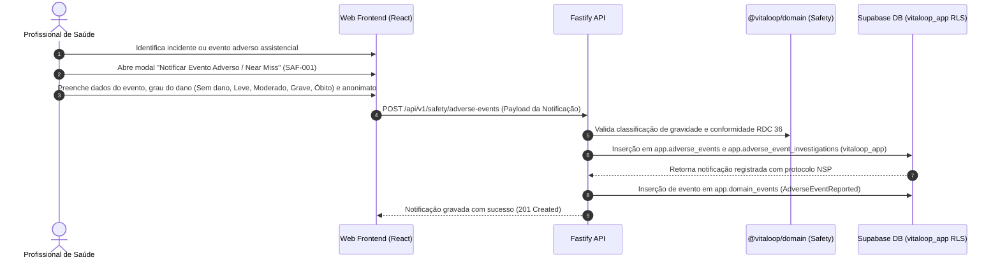

# Plano de Implementação — Fase 6 / Etapa 1 de X: Segurança do Paciente, Notificação de Eventos Adversos, Precauções e Auditoria Clínica (`SAF-001..011`)

## 1. Confirmação do Encerramento Integral das Etapas Anteriores

Todas as etapas das Fases 0, 1, 2, 3, 4 e 5 foram concluídas, testadas e homologadas com Gate Pass confirmado:

1. **Fase 0–3:** 100% Homologadas com Gate Pass (Prontuário, Filas, Consulta Médica, Diagnósticos CID-10, Prescrição, Exames e Desfecho/Alta).
2. **Fase 4 / Etapa 1 (`NUR-001..003`, `MEDC-009..011`):** Admissão, Evolução, Anotação de Enfermagem, Aprazamento e Checagem 5 Certos — **HOMOLOGADA COM GATE PASS** (`docs/PHASE_4_STEP_1_REPORT.md`).
3. **Fase 4 / Etapa 2 (`BED-001..013`):** Gestão de Leitos UPA 24h, Setores, Mapa de Ocupação e Transferências — **HOMOLOGADA COM GATE PASS** (`docs/PHASE_4_STEP_2_REPORT.md`).
4. **Fase 4 / Etapa 3 (`NUR-004..012`):** SAE, Diagnósticos NANDA/CIPA, Prescrição de Cuidados, Escalas Braden/Morse/Glasgow/MEWS, Balanço Hídrico e Dispositivos Invasivos — **HOMOLOGADA COM GATE PASS** (`docs/PHASE_4_STEP_3_REPORT.md`).
5. **Fase 5 / Etapa 1 (`DOC-001..010`):** Emissão de Atestados Médicos, Declarações de Comparecimento, Templates e Relatórios Clínicos Estruturados — **HOMOLOGADA COM GATE PASS** (`docs/PHASE_5_STEP_1_REPORT.md`).

---

## 2. Identificação Oficial da Próxima Etapa

Conforme o Blueprint Funcional Clínico (`Documento 1` §59), a Matriz de Rastreabilidade (`Documento 3` Seção 20) e a sequência assistencial pós-documentos clínicos:

- **Macro-Fase:** FASE 6 — SEGURANÇA DO PACIENTE, NOTIFICAÇÃO DE EVENTOS ADVERSOS, PRECAUÇÕES E AUDITORIA CLÍNICA
- **Etapa Oficial:** ETAPA 1 DE X DA FASE 6 — GESTÃO DA SEGURANÇA DO PACIENTE, NOTIFICAÇÃO COMPULSÓRIA DE EVENTOS ADVERSOS, ISOLAMENTO ASSISTENCIAL E PAINEL NSP
- **Requisitos Cobertos:** `SAF-001`, `SAF-002`, `SAF-003`, `SAF-004`, `SAF-005`, `SAF-006`, `SAF-007`, `SAF-008`, `SAF-009`, `SAF-010`, `SAF-011`
- **Sustentação Documental:** Blueprint Funcional Clínico (`Documento 1` §59: Segurança do Paciente), Matriz de Rastreabilidade (`Documento 3` Seção 20: `SAF-001..011`) e Resolução ANVISA RDC nº 36/2013 (Núcleo de Segurança do Paciente - NSP).

---

## 3. Objetivo Clínico e Assistencial

Estruturar o sistema de gestão da Segurança do Paciente na UPA 24h conforme as diretrizes do Núcleo de Segurança do Paciente (NSP / ANVISA RDC 36/2013) e PNSP (Portaria MS 529/2013). O módulo garante a notificação anônima ou identificada de Eventos Adversos e Quase Falhas (*Near Miss*), monitoramento contínuo de riscos de Queda (Escala de Morse) e Lesão por Pressão (Escala de Braden), checagem compulsória de pulseiras de identificação e alertas de alergia, registro de Reações Adversas a Medicamentos (RAM), gestão de Precauções e Isolamento Assistencial (contato, gotículas, aerossóis), Notificação Compulsória Epidemiológica de Agravos e Painel de Auditoria de Causa Raiz (RCA) do NSP.

---

## 4. Requisitos Abrangidos nesta Etapa (`SAF-001..011`)

| Requisito | Nome do Requisito | Descrição Sintética |
| :--- | :--- | :--- |
| **SAF-001** | Notificação de Eventos Adversos / Near Miss | Registro estruturado de incidentes assistenciais com/sem dano e quase falhas para análise de causa raiz pelo NSP. |
| **SAF-002** | Gestão de Risco de Quedas | Classificação do risco de queda e protocolo de prevenção associado ao leito/atendimento do paciente. |
| **SAF-003** | Prevenção de Lesão por Pressão (LPP) | Protocolo de mudança de decúbito e proteção de proeminências ósseas atrelado ao escore da Escala de Braden. |
| **SAF-004** | Validação de Pulseira de Identificação | Verificação compulsória de dados da pulseira (Nome, DN, Mãe, Prontuário) antes de procedimentos e medicações. |
| **SAF-005** | Alertas Compulsórios de Alergia | Sinalização visual e bloqueio assistencial em caso de tentativa de prescrição/administração de substâncias alergênicas. |
| **SAF-006** | Reação Adversa a Medicamento (RAM) | Notificação de farmacovigilância sobre reações inesperadas ou graves decorrentes do uso de fármacos. |
| **SAF-007** | Gestão de Isolamento Assistencial | Marcação de necessidade de isolamento (Padrão, Contato, Gotículas, Aerossóis) com sinalização em leitos e prontuário. |
| **SAF-008** | Sinalização de Precauções Específicas | Alertas para riscos especiais (paciente agitado, risco de fuga, broncoaspiração, hipoglicemia). |
| **SAF-009** | Monitoramento de Dispositivos e IRAS | Alertas de tempo de permanência de cateteres e sondas para prevenção de Infecções Relacionadas à Assistência à Saúde. |
| **SAF-010** | Notificação Compulsória Epidemiológica | Formulário de notificação imediata à Vigilância Epidemiológica para doenças de notificação compulsória (SINAN). |
| **SAF-011** | Painel NSP e Auditoria de Causa Raiz | Dashboard do Núcleo de Segurança do Paciente para investigação, matriz de severidade (Fishbone/5 Porquês) e plano de ação. |

---

## 5. Fluxo Funcional Esperado



---

## 6. Modelo de Dados Proposto (Especificação da Migration 0036)

A ser criada no momento da execução como `db/migrations/0036_patient_safety_adverse_events.sql` (estritamente aditiva, sem alterar 0001 a 0035):

```sql
-- Migration 0036: Segurança do Paciente, Eventos Adversos e Isolamento (SAF-001..011)

do $$ begin
  create type app.incident_severity as enum ('near_miss', 'no_harm', 'mild', 'moderate', 'severe', 'death');
exception when duplicate_object then null; end $$;

do $$ begin
  create type app.isolation_type as enum ('standard', 'contact', 'droplet', 'airborne', 'protective');
exception when duplicate_object then null; end $$;

-- 1. Notificações de Eventos Adversos e Quase Falhas (SAF-001, SAF-006, SAF-010)
create table if not exists app.adverse_events (
  id uuid primary key default gen_random_uuid(),
  encounter_id uuid references app.encounters(id) on delete set null,
  patient_id uuid references app.patients(id) on delete set null,
  reporter_id uuid references app.users(id) on delete set null,
  is_anonymous boolean not null default false,
  event_category text not null, -- medicação, queda, lpp, identificação, cirúrgico, infecção, etc.
  severity app.incident_severity not null,
  event_date timestamptz not null,
  description text not null,
  immediate_action text,
  is_epidemiological_notification boolean not null default false,
  sinan_code text,
  status text not null default 'reported', -- reported, under_investigation, closed
  created_at timestamptz not null default now(),
  updated_at timestamptz not null default now()
);

-- 2. Registros de Isolamento e Precauções do Paciente (SAF-007, SAF-008)
create table if not exists app.patient_isolations (
  id uuid primary key default gen_random_uuid(),
  encounter_id uuid not null references app.encounters(id) on delete cascade,
  patient_id uuid not null references app.patients(id) on delete cascade,
  isolation_type app.isolation_type not null,
  reason text not null,
  pathogen_suspected text,
  prescribed_by uuid not null references app.users(id) on delete restrict,
  start_at timestamptz not null default now(),
  end_at timestamptz,
  ended_by uuid references app.users(id) on delete restrict,
  is_active boolean not null default true,
  created_at timestamptz not null default now()
);

-- 3. Análise de Causa Raiz pelo NSP (SAF-011)
create table if not exists app.adverse_event_investigations (
  id uuid primary key default gen_random_uuid(),
  event_id uuid not null references app.adverse_events(id) on delete cascade,
  investigator_id uuid not null references app.users(id) on delete restrict,
  root_cause_analysis text not null, -- Fishbone / 5 Porquês
  action_plan text not null,
  preventive_measures text,
  closed_at timestamptz,
  created_at timestamptz not null default now()
);

-- Habilitar RLS
alter table app.adverse_events enable row level security;
alter table app.patient_isolations enable row level security;
alter table app.adverse_event_investigations enable row level security;

-- Políticas RLS
drop policy if exists adverse_events_select on app.adverse_events;
drop policy if exists adverse_events_insert on app.adverse_events;
create policy adverse_events_select on app.adverse_events for select to vitaloop_app using (app.has_permission('safety.read'));
create policy adverse_events_insert on app.adverse_events for insert to vitaloop_app with check (app.has_permission('safety.report'));

drop policy if exists patient_isolations_select on app.patient_isolations;
drop policy if exists patient_isolations_insert on app.patient_isolations;
create policy patient_isolations_select on app.patient_isolations for select to vitaloop_app using (app.has_permission('safety.read'));
create policy patient_isolations_insert on app.patient_isolations for insert to vitaloop_app with check (app.has_permission('safety.manage'));

drop policy if exists adverse_event_investigations_select on app.adverse_event_investigations;
create policy adverse_event_investigations_select on app.adverse_event_investigations for select to vitaloop_app using (app.has_permission('safety.investigate'));

-- Concessões à role vitaloop_app
grant select, insert, update, delete on app.adverse_events to vitaloop_app;
grant select, insert, update, delete on app.patient_isolations to vitaloop_app;
grant select, insert, update, delete on app.adverse_event_investigations to vitaloop_app;

-- Permissões RBAC
insert into app.permissions (code, name, resource, action) values
  ('safety.read',        'Consultar painel de segurança do paciente e isolamentos', 'safety', 'read'),
  ('safety.report',      'Notificar eventos adversos e quase falhas', 'safety', 'report'),
  ('safety.manage',      'Prescrever e gerenciar isolamentos e precauções', 'safety', 'manage'),
  ('safety.investigate', 'Investigar causa raiz e fechar análises do NSP', 'safety', 'investigate')
on conflict (code) do nothing;

insert into app.role_permissions (role_id, permission_id)
select r.id, p.id from app.roles r, app.permissions p
where r.code in ('doctor', 'nurse', 'admin', 'nsp_auditor', 'test_patient_full')
  and p.code in ('safety.read', 'safety.report', 'safety.manage', 'safety.investigate')
on conflict do nothing;
```

---

## 7. Camada de Domínio (`@vitaloop/domain`)
- Módulo `packages/domain/src/safety/`:
  - `validateAdverseEventInput(...)`: Validações de descrição (min 15 chars), severidade e categoria de incidente.
  - `validatePatientIsolationInput(...)`: Validação de prescrição de isolamento e motivo técnico.
  - Eventos de Domínio: `AdverseEventReported`, `PatientIsolationPrescribed`, `PatientIsolationEnded`.

---

## 8. Especificação de APIs REST (Fastify)
- `POST /api/v1/safety/adverse-events` (Notificação de evento adverso)
- `GET /api/v1/safety/adverse-events` (Listagem para o NSP)
- `POST /api/v1/encounters/:encounterId/isolations` (Prescrição de isolamento)
- `GET /api/v1/encounters/:encounterId/isolations` (Consulta de isolamentos ativos)
- `PATCH /api/v1/isolations/:id/end` (Encerramento de isolamento)

---

## 9. Componentes Frontend React (`apps/web`)
- `AdverseEventReportModal.tsx`: Modal para notificação de eventos adversos e near miss.
- `PatientIsolationBadge.tsx`: Badge e modal de sinalização de precaução/isolamento assistencial.

---

## 10. Estratégia de Testes e Critérios de Gate PASS
- Testes unitários do domínio.
- Teste de componente UI.
- Testes de integração Fastify `.inject()` contra o Supabase remoto utilizando a role `vitaloop_app` sob RLS.
- Regressão integral Fases 0–5 (100% PASS).
- ESLint 0 erros/avisos, Typecheck 0 erros, Build 0 erros, Zero resíduos no Supabase (`TEST DATA RESIDUAL: 0`).

---

## 11. Itens "NÃO DEFINIDO NO BLUEPRINT"
- Integração webservice síncrona direta via API REST pública do VIGIMED / NOTIVISA da ANVISA.
- Reconhecimento automático de queda por inteligência artificial em câmeras de monitoramento CFTV.

---

## 12. Itens Fora do Escopo
- Faturamento SUS / AIH (`SUS-001..010` — reservados para a Fase 8).
- Barramento FHIR/HL7 (`INT-001..010` — reservados para a Fase 9).

---

STATUS: PLANEJAMENTO CONCLUÍDO
EXECUÇÃO: NÃO INICIADA
ALTERAÇÕES NO CÓDIGO: NENHUMA
ALTERAÇÕES NO BANCO: NENHUMA
MIGRATION: NÃO CRIADA/APLICADA
SUPABASE: NÃO ALTERADO
COMMIT/PUSH: NÃO REALIZADO
