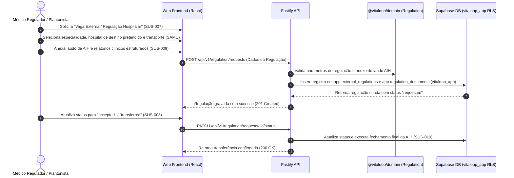

# Plano de Implementação — Fase 8 / Etapa 2 de 2: Regulação Médica de Vagas Externas, Transferência Inter-Hospitalar, Documentação e Validação Final da AIH (`SUS-007..010`)

## 1. Identificação Oficial da Fase
- **Fase:** FASE 8 — REGULAÇÃO, FATURAMENTO SUS E AIH
- **Macro-Fase no Roadmap:** FASE 8 (Correspondente à Seção 22 da Matriz de Rastreabilidade)

---

## 2. Identificação Oficial da Etapa
- **Etapa:** ETAPA 2 DE 2 DA FASE 8
- **Nome Oficial da Etapa:** REGULAÇÃO MÉDICA DE VAGAS EXTERNAS, TRANSFERÊNCIA INTER-HOSPITALAR, DOCUMENTAÇÃO E VALIDAÇÃO FINAL DA AIH
- **Requisitos Cobertos:** `SUS-007`, `SUS-008`, `SUS-009`, `SUS-010`

---

## 3. Justificativa Documental da Escolha da Etapa 2

1. **Confirmação do Status Atual:**
   - **Fases 0 a 7:** Integralmente homologadas com Gate Pass Confirmado.
   - **Fase 8 / Etapa 1 (`SUS-001..006`):** Laudo AIH, Catálogo SIGTAP e Validações de Compatibilidade — **HOMOLOGADA COM GATE PASS CONFIRMADO** (`docs/PHASE_8_STEP_1_REPORT.md` e `VITALOOP_1.3_STATUS.md` §0-M).
   - **Requisitos Homologados da Fase 8:** `SUS-001`, `SUS-002`, `SUS-003`, `SUS-004`, `SUS-005`, `SUS-006`.
   - **Requisitos Pendentes da Fase 8:** `SUS-007`, `SUS-008`, `SUS-009`, `SUS-010`.

2. **Sustentação Documental:**
   - **Matriz de Rastreabilidade (`Documento 3` Seção 22):** Registra formalmente a necessidade dos fluxos de Regulação (`SUS-007`), Transferência Externa (`SUS-008`), Documentação de Suporte (`SUS-009`) e Validação/Fechamento da AIH (`SUS-010`).
   - **Blueprint Funcional Clínico (`Documento 1` §45 e §58):** Especifica a solicitação de vagas externas, acompanhamento de prioridade/status, confirmação de transporte (SAMU/Ambulância) e fechamento do lote da AIH/Faturamento.

---

## 4. Requisitos Abrangidos nesta Etapa (`SUS-007..010`)

| Código | Requisito | Descrição Sintética | Fonte Documental | Status Atual | Dependências |
| :--- | :--- | :--- | :--- | :---: | :--- |
| **SUS-007** | Regulação Médica | Solicitação formal de vaga hospitalar externa e regulação médica inter-hospitalar. | Matriz §22 / Blueprint §45 | `NÃO INICIADO` | `SUS-001..006`, `OUT-001`, `BED-001` |
| **SUS-008** | Transferência Externa | Gestão de status da regulação (solicitada, aceita, transferida), meio de transporte (SAMU/UTI móvel) e confirmação de vaga. | Matriz §22 / Blueprint §45 | `NÃO INICIADO` | `SUS-007` |
| **SUS-009** | Documentação da Regulação | Anexo e vinculação de relatórios clínicos estruturados, exames e documentos à solicitação de regulação/AIH. | Matriz §22 / Blueprint §45/§58 | `NÃO INICIADO` | `DOC-001..010`, `SUS-001` |
| **SUS-010** | Validação Final da AIH | Validação completa de fechamento do lote de AIH/Faturamento e encerramento do espelho. | Matriz §22 / Blueprint §58 | `NÃO INICIADO` | `SUS-001..009` |

---

## 5. Dependências

A Etapa 2 da Fase 8 integra-se com os seguintes módulos já homologados:
- **Pacientes e Atendimentos (`PAT-001..017`, `ENC-001..013`):** Dados de identificação do paciente, CNS e dados da urgência UPA.
- **Consulta Médica & CID-10 (`MED-001..013`):** Diagnóstico e conduta médica de necessidade de transferência hospitalar.
- **Gestão de Leitos e Desfechos (`BED-001..013`, `OUT-001..011`):** Leito de observação/retencao do paciente e desfecho assistencial do tipo "Transferência Inter-hospitalar".
- **Documentos Clínicos (`DOC-001..010`):** Relatórios de transferência e atestados clínicos anexados à regulação.
- **Faturamento SUS & Laudo AIH (`SUS-001..006`):** Laudo prévio de solicitação de AIH emitido e validado na Etapa 1.

---

## 6. Objetivo Clínico e Operacional
Prover o fluxo completo de Regulação Médica de Vagas Hospitalares Externas (Centrais de Regulação SISREG/CROSS) e Transferência Inter-Hospitalar para pacientes atendidos na UPA 24h que necessitam de internação em leitos de alta complexidade ou especialidades hospitalares. O módulo gerencia o status da solicitação de vaga, atribuição de meio de transporte de urgência (SAMU / UTI Móvel), anexo de laudos/documentos clínicos e a validação final/fechamento do lote da AIH para o faturamento público SUS sem risco de glosa.

---

## 7. Fluxo Assistencial Previsto



---

## 8. Regras de Negócio Sustentadas Documentalmente

1. **Obrigariedade do Laudo AIH (SUS-007, SUS-009):** Nenhuma regulação externa para leito de internação hospitalar pode ser criada sem a prévia vinculação a um Laudo de AIH validado (`SUS-001..006`).
2. **Ciclo de Vida da Regulação (SUS-008):** Uma regulação transita estritamente entre os estados:
   `requested` (Solicitada) → `in_regulation` (Em Regulação) → `accepted` (Vaga Confirmada) → `transferred` (Transferência Realizada) ou `canceled` (Cancelada).
3. **Validação Final de AIH (SUS-010):** O fechamento final da AIH requer a confirmação do desfecho do paciente (Alta ou Transferência) e a inexistência de inconsistências nas regras de compatibilidade SIGTAP.

---

## 9. Proposta de Arquitetura (Somente em Nível de Planejamento)

### A. Banco de Dados (Especificação da Migration 0039 Proposta)
A ser criada no momento da execução como `db/migrations/0039_external_regulation_transfer.sql` (estritamente aditiva, sem alterar 0001 a 0038):

```sql
-- Migration 0039: Regulação Médica, Transferência Externa e Fechamento de AIH (SUS-007..010)

-- 1. Tabela de Solicitacoes de Regulacao Externa (SUS-007, SUS-008)
create table if not exists app.external_regulations (
  id uuid primary key default gen_random_uuid(),
  encounter_id uuid not null references app.encounters(id) on delete cascade,
  patient_id uuid not null references app.patients(id) on delete cascade,
  requester_id uuid not null references app.users(id) on delete restrict,
  aih_request_id uuid references app.aih_requests(id) on delete set null,
  destination_facility text not null,
  specialty text not null,
  priority text not null default 'high', -- 'low', 'medium', 'high', 'emergency'
  transport_type text not null default 'basic_ambulance', -- 'basic_ambulance', 'uti_mobile', 'samu', 'own_means'
  status text not null default 'requested', -- 'requested', 'in_regulation', 'accepted', 'transferred', 'canceled'
  cancellation_reason text,
  confirmed_at timestamptz,
  confirmed_by uuid references app.users(id) on delete restrict,
  created_at timestamptz not null default now(),
  updated_at timestamptz not null default now()
);

-- 2. Tabela de Documentos Vinculados à Regulação (SUS-009)
create table if not exists app.regulation_documents (
  id uuid primary key default gen_random_uuid(),
  regulation_id uuid not null references app.external_regulations(id) on delete cascade,
  document_type text not null, -- 'clinical_report', 'exam_result', 'aih_form'
  document_id uuid,
  notes text,
  attached_by uuid not null references app.users(id) on delete restrict,
  created_at timestamptz not null default now()
);

-- 3. Habilitar RLS
alter table app.external_regulations enable row level security;
alter table app.regulation_documents enable row level security;

-- 4. Políticas RLS
drop policy if exists external_regulations_select on app.external_regulations;
drop policy if exists external_regulations_insert on app.external_regulations;
drop policy if exists external_regulations_update on app.external_regulations;
create policy external_regulations_select on app.external_regulations for select to vitaloop_app using (app.has_permission('regulation.read'));
create policy external_regulations_insert on app.external_regulations for insert to vitaloop_app with check (app.has_permission('regulation.manage'));
create policy external_regulations_update on app.external_regulations for update to vitaloop_app using (app.has_permission('regulation.manage'));

drop policy if exists regulation_documents_select on app.regulation_documents;
drop policy if exists regulation_documents_insert on app.regulation_documents;
create policy regulation_documents_select on app.regulation_documents for select to vitaloop_app using (app.has_permission('regulation.read'));
create policy regulation_documents_insert on app.regulation_documents for insert to vitaloop_app with check (app.has_permission('regulation.manage'));

-- 5. Concessões de Permissões à role vitaloop_app
grant select, insert, update, delete on app.external_regulations to vitaloop_app;
grant select, insert, update, delete on app.regulation_documents to vitaloop_app;

-- 6. Permissões RBAC
insert into app.permissions (code, name, resource, action) values
  ('regulation.read',   'Consultar solicitações de regulação e transferências externas', 'regulation', 'read'),
  ('regulation.manage', 'Solicitar e gerenciar regulação médica e transferências', 'regulation', 'manage')
on conflict (code) do nothing;

insert into app.role_permissions (role_id, permission_id)
select r.id, p.id from app.roles r, app.permissions p
where r.code in ('admin', 'doctor', 'nurse', 'test_patient_full')
  and p.code in ('regulation.read', 'regulation.manage')
on conflict do nothing;
```

### B. Camada de Domínio (`packages/domain/src/regulation/`)
- `validateRegulationInput(...)`: Validação da solicitação de regulação, destino e prioridade.
- `validateRegulationStatusTransition(...)`: Validação de máquina de estados para transições de status de regulação.
- Eventos de Domínio: `ExternalRegulationRequested`, `ExternalRegulationAccepted`, `PatientTransferredExternally`.

### C. Especificação de APIs REST (Fastify em `apps/api/src/routes/regulation.ts`)
- `POST /api/v1/regulation/requests` (Solicitação de vaga externa)
- `GET /api/v1/regulation/requests` (Consulta de solicitações ativas)
- `GET /api/v1/regulation/requests/:id` (Detalhes da solicitação)
- `PATCH /api/v1/regulation/requests/:id/status` (Atualização de status da regulação/transferência)
- `POST /api/v1/sus/aih-requests/:id/close` (Validação e fechamento final da AIH)

### D. Componentes Frontend React (`apps/web`)
- `ExternalRegulationModal.tsx`: Componente React para solicitação de vaga, acompanhamento de transporte e fechamento final de AIH.

---

## 10. Estratégia de Testes e Critérios de GATE PASS

- **Testes Unitários:** Validação de regras de domínio e transição de status de regulação.
- **Testes de UI React:** Renderização do modal de regulação e disparo de ações.
- **Testes de Integração Remota:** Suíte Fastify `.inject()` executando contra o Supabase remoto sob RLS `vitaloop_app`.
- **Regressão:** 100% de aprovação na suíte de regressão das Fases 0–8 / Etapa 1.
- **Qualidade de Código:** ESLint 0 erros/0 avisos, Typecheck 0 erros, Monorepo Build PASS.
- **Limpeza de Banco:** Zero resíduos de dados de teste no Supabase DB (`TEST DATA RESIDUAL: 0`).

---

## 11. Itens Explicitamente Fora do Escopo desta Etapa
- Integração webservice síncrona direta via API REST privada com os sistemas SISREG (Ministério da Saúde) ou CROSS (Secretaria de Saúde SP) — reservada para a Fase 9 (Integrações HL7/FHIR).
- Faturamento de convênios de medicina suplementar / planos de saúde privados (TISS/TUSS).

---

## 12. "NÃO DEFINIDO NO BLUEPRINT"
- Algoritmo automatizado por inteligência artificial para decisão autônoma de aceitação de vagas sem intervenção de médico regulador humano.

---

STATUS:
PLANEJAMENTO CONCLUÍDO

FASES/ETAPAS HOMOLOGADAS:
- Fase 0 (Fundamentos) — GATE PASS
- Fase 1 (Identidade e Segurança) — GATE PASS
- Fase 2 (Prontuário e Atendimento UPA) — GATE PASS
- Fase 3 (Consulta Médica, CID-10, Prescrição, Exames, Alta) — GATE PASS
- Fase 4 / Etapas 1, 2 e 3 (Enfermagem, SAE e Leitos UPA) — GATE PASS
- Fase 5 / Etapa 1 (Documentos Clínicos, Atestados) — GATE PASS
- Fase 6 / Etapa 1 (Segurança do Paciente, Eventos Adversos, NSP) — GATE PASS
- Fase 7 / Etapa 1 (Gestão Operacional e Dashboards UPA) — GATE PASS
- Fase 8 / Etapa 1 (Faturamento SUS, SIGTAP e Laudo AIH) — GATE PASS

FASE ATUAL:
FASE 8

ETAPA ANTERIOR:
FASE 8 / ETAPA 1 — GATE PASS

PRÓXIMA ETAPA:
FASE 8 / ETAPA 2 DE 2

NOME:
REGULAÇÃO MÉDICA DE VAGAS EXTERNAS, TRANSFERÊNCIA INTER-HOSPITALAR, DOCUMENTAÇÃO E VALIDAÇÃO FINAL DA AIH

REQUISITOS:
SUS-007, SUS-008, SUS-009, SUS-010

REQUISITOS JÁ HOMOLOGADOS NA FASE 8:
SUS-001..006

REQUISITOS PENDENTES:
SUS-007..010

JUSTIFICATIVA:
Conforme Matriz §22 e Blueprint §45/§58, a Etapa 2 conclui os requisitos pendentes da Fase 8 adicionando a Regulação Médica de Vagas Externas, Transferência Inter-hospitalar, Anexo de Documentos Clínicos e Fechamento Final da AIH.

EXECUÇÃO:
NÃO INICIADA

ALTERAÇÕES NO CÓDIGO:
NENHUMA

ALTERAÇÕES NO BANCO:
NENHUMA

MIGRATION:
NÃO CRIADA/APLICADA

SUPABASE:
NÃO ALTERADO

COMMIT/PUSH:
NÃO REALIZADO

DOCUMENTO:
implementation_plan_phase_8_step_2.md
